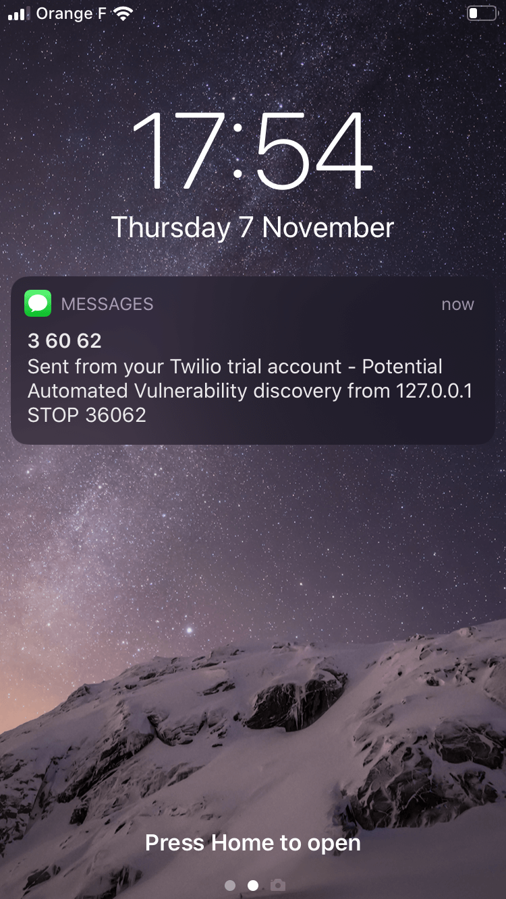
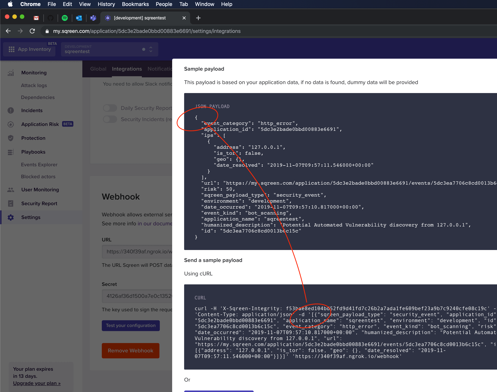

# Sqreen

## Exercise

First plug an application to Sqreen and enable the webhook notifications (create a free account on https://my.sqreen.io).

We want to create a Python/Flask application that listen for webhook notifications from Sqreen.

On receiving a notification the application should:
1. Check that the signature is correct
2. Redispatch the notification to multiple targets (e.g. log, email, HTTP, SMS, Slack).

Requirements:
- Have a generic interface for target backends
- Two target backends
- Have relevant tests

Hints:
- The application that is receiving webhook can itself be Sqreened
- Detected attacks are batched 5-minutely between a running agent and Sqreen own backend (the first one will fire
directly, then they are aggregated).
- One can easily generate a notification by calling: curl -A Arachni/v1.2.1 http://sqreened_application

## Result

Notes:
- Use `ngrok` to be able to expose the server to Sqreen.
- Use `Github CI` instead of `CircleCI` or `TravisCI` (which I already know so I wanted to test `Github CI`).
- A pre-release of `black` is used until its installation requirements are fixed. 

Installation:
```bash
poetry install
```

Test:
```bash
poetry run black --check .
poetry run pylint app.py sqreentest
poetry run mypy app.py sqreentest
poetry run pytest
```

Launch application:
```bash
FLASK_DEBUG=1 poetry run flask run
```

Implemented targets:
- Logs
- SMS (using Twillo): 

## Questions

1. Currently if a webhook is not handled (bug in code, target in unavailable, etc.) then it disappears as it is not
stored in this application for retry (in a database for example). But I think in case of webhooks, it is the
responsibility of the origin server to retry (possibly up to N times for example) until the destination returns a
successful response (for example the infrastructure powering the destination server might be down). Did I miss something?

2. In the application, sample webhook payload is a JSON object while `curl` command is a JSON array as well as the data
sent: 

3. Sqreen does not seem to expose typings, which cause `mypy` to fail with:
```
> poetry run mypy app.py sqreentest
app.py:2: error: Cannot find module named 'sqreen'
app.py:2: note: See https://mypy.readthedocs.io/en/latest/running_mypy.html#missing-imports
```

Current workaround is to replace:
```python
import sqreen
```
by
```python
import sqreen  # type: ignore
```
